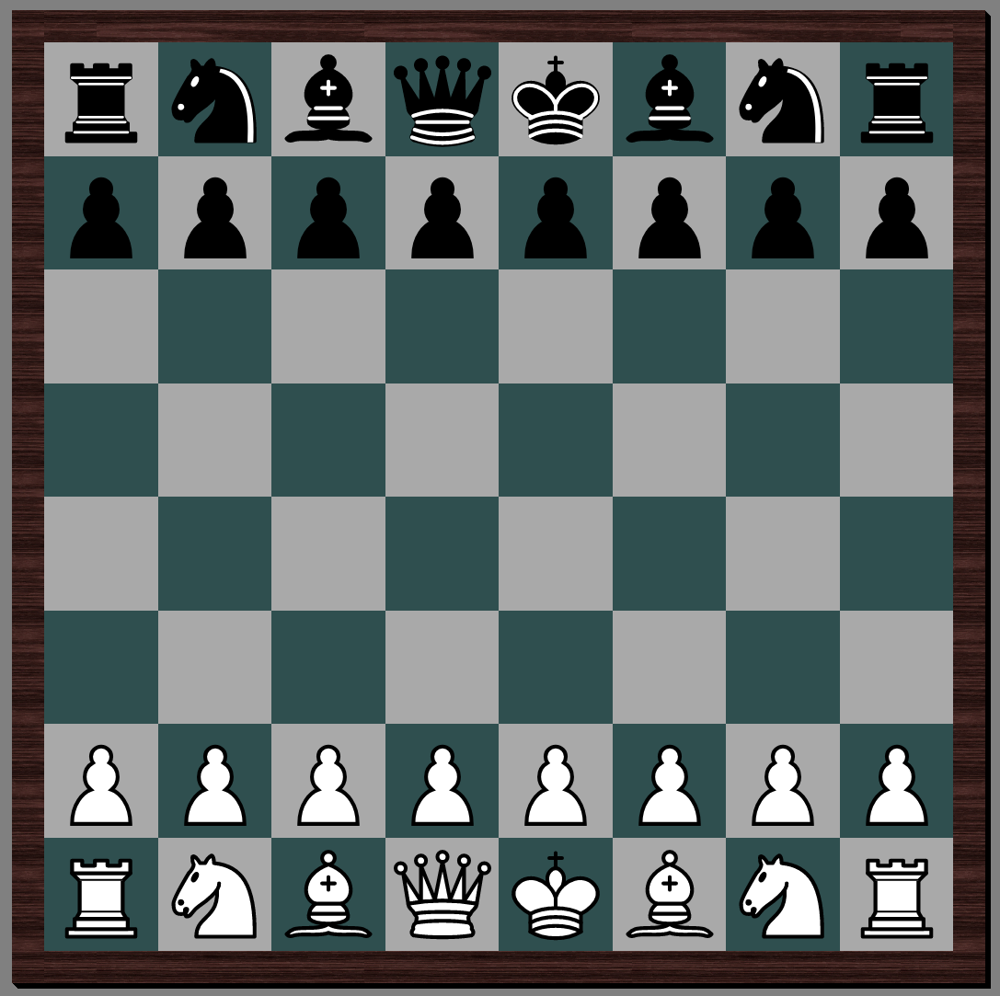

# Web-Game
TUD Web Assignment 1

### Overview
A multiplayer web chess game with support for multiple rooms. 

### Building & Running
Clone the repository, make sure to have npm and nodejs installed, go to the project directory and run `npm start`. Then go to `localhost:3000` on your browser. You need 2 players for the game to start.

### Left to implement:
**Splash screen:**
- Add css
- Add panel for statistics
- Add list of rooms
**Server:**
- Game over, game start & game disconnected message sending 
- Castling, promotions, victory detection & en passe
- Add support for statistics
- Lobbys (Let people choose a room)
**Client:**
- Board rotation when playing black pieces
- Highlight last played piece
- Change tab title content
- Sound
- Information panel with clock & statistics
- Add favicon
**Other:**
- Chess piece image license
